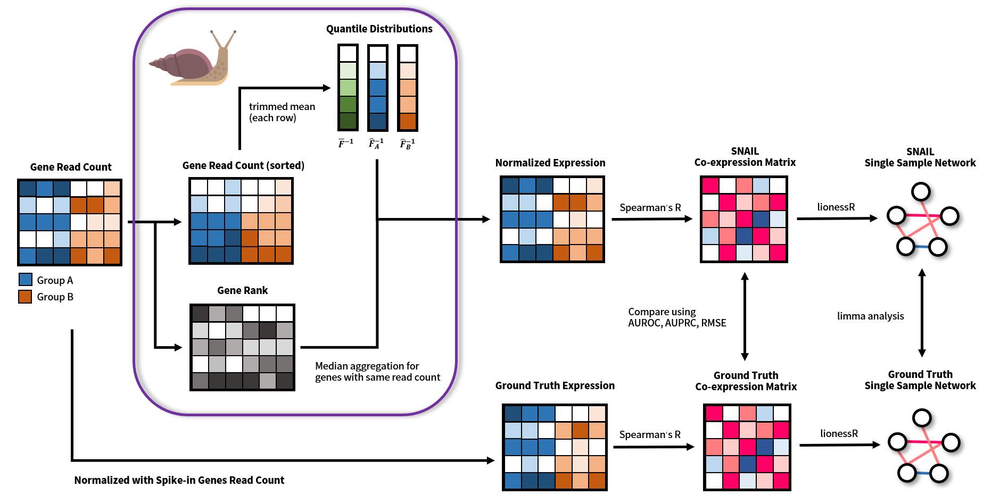

# PySNAIL
**S**mooth-quantile **N**ormalization **A**daptation for **I**nference of co-expression **L**inks (SNAIL) is a method that corrects for false-positive associations, which may form between lowly expressed genes after smooth quantile normalization of the data, and which may affect downstream co-expression network analysis. The PySNAIL software is developed by the [Kuijjer Lab](https://www.kuijjerlab.org/).

## Method
SNAIL is an alternative implementation of [smooth quantile normalization (qsmooth)](https://academic.oup.com/biostatistics/article-lookup/doi/10.1093/biostatistics/kxx028), designed to correct false-positive gene associations in *qsmooth*-normalized RNA-Seq data. Specifically, instead of using the mean value of counts to normalize the expression of genes with the same read count, as is done in the original _qsmooth_ algorithm, SNAIL uses median aggregation (step 7 and step 8 in the following figure). We developed PySNAIL as a standalone Python package supporting multi-thread optimization. We've also implemented a diagnostic function that computes the proportion of affected genes for each sample, to help detect whether smooth quantile normalization would introduce false-positive co-expression between genes in a specific dataset. 



# Usage
## Installation
### Environment Setting
It is highly recommended to use the [conda](https://docs.conda.io/projects/conda/en/latest/index.html) virtual environment to install this package. After installation of conda, create a virtual environment for PySNAIL using the following command:
```bash
$ conda create -n pysnail python=3.7.7
$ conda activate pysnail
```

### Install Package
Download the source code from `git@github.com:kuijjerlab/PySNAIL.git` and install the package using `pip`:
```bash
$ git clone git@github.com:kuijjerlab/PySNAIL.git
$ cd PySNAIL
$ pip install -e .
```
To reproduce the analysis we provide in the manuscript (we use pip to install the Python dependency simply to improve the efficiency of solving conflicts between packages):
```bash
$ git clone git@github.com:kuijjerlab/PySNAIL.git
$ cd PySNAIL
$ conda activate pysnail
$ conda config --add channels anaconda
$ conda config --add channels defaults
$ conda config --add channels bioconda
$ conda config --add channels conda-forge
$ conda config --add channels bokeh
$ conda install --file conda_requirement.txt
$ pip install -r pip_requirement.txt
$ pip install -e .
```

### Example Dataset
The PySNAIL packages includes an example dataset for users to test the method on. This can be found under the `test` directory. The `expression.tsv` contains expression levels for 10,000 randomly selected genes from [the Mouse ENCODE Project Consortium](https://www.encodeproject.org/reference-epigenome-matrix/?type=Experiment&related_series.@type=ReferenceEpigenome&replicates.library.biosample.donor.organism.scientific_name=Mus+musculus). The `groups.tsv` contains the tissue information for each sample. 
```bash
$ sample_data/expression.tsv
$ sample_data/groups.tsv
```

## Quick Start
After installation, PySNAIL can be executed directly as a Python module using the following command:
```
$ pysnail sample_data/expression.tsv --groups sample_data/groups.tsv --dist --outdir output
```
The complete arguments are listed as follows (one can get this information by executing `pysnail --help`)
```
    pysnail -h
    usage: pysnail [-h] [-g [path]] [-m {'mean', 'median', 'auto'}]
        [-t [threshold]] [-o [path]] xprs

    Python implementation of Smooth-quantile Normalization Adaptation for 
    Inference of co-expression Links (PySNAIL)

    positional arguments:
        xprs            Path to the expression data. The file should be
                        formatted as follows: the rows should represent genes
                        (the first row must be the sample names), and the
                        columns should represent samples (the first column
                        must be the gene names). The columns must be separated
                        with <tab>.

    optional arguments:
        -h, --help      show this help message and exit
        -g [path], --groups [path]
                        Path to the group information for each sample. The
                        file should have two columns without any header. The
                        first column should be the sample names, corresponds
                        to the columns in xprs. The second column should be
                        the group information for each sample. The two columns
                        must be separated by <tab>. If this argument is not
                        provided, the algorithm will treat all samples as one
                        group.
        -m {'mean', 'median', 'auto'}, --method {'mean', 'median', 'auto'}
                        Method used compute the aggregate statistics for
                        quantile with same value in each group, should be
                        either 'mean', 'median' or 'auto'. If set to 'auto',
                        the algorithm is going to use median aggregation if
                        the proportion of the affected samples is larger or
                        equal to [--threshold] (default: 0.25). Default:
                        'median'.
        -t [threshold], --threshold [threshold]
                        Threshold of the proportion of samples being affected
                        if mean aggregation is being used. The algorithm is
                        going to use median aggregation if the proportion of
                        the affected samples is larger or equal to this
                        threshold when [--method] is set to 'auto'. This
                        argument is ignored if method is specified with 'mean'
                        or 'median'. Defulat: 0.25
        -o [path], --outdir [path]
                        Output directory for the corrected qsmooth expression
                        and some informative statistics. The directory
                        consists of a data table 'xprs_norm.tsv' with the
                        corrected expression levels. Default: './output'.

```

## Reproduce Analysis in the Manuscript
The `bioconductor-encodexplorer` package used in the original analysis is deprecated. To reproduce the analysis, please download the ENCODE dataset from [here](https://drive.google.com/file/d/1um7NyiXd_BVYUPGMaOFZEf0y2vnqdCaR/view?usp=sharing) before executing the following commands. 
To reproduce analysis in the manuscript:
```bash
$ cd PySNAIL
$ # download the ZIP file and put it here.
$ mkdir -p manuscript_analysis/datasets/
$ unzip PySNAIL-ENCODE.zip
$ mv ENCODE manuscript_analysis/datasets/
$ snakemake --cores [n]
```
The result can be found in the directory `manuscript_analysis`. Note that it will likely take a while to download and preprocess the datasets.

## Application Programming Interface
PySNAIL also provides an application programming interface (API) in Python for developers or bioinformaticians who wants to control more parameters used in the analysis.

### Correct Expression
```python
import os
from pysnail import Dataset, qsmooth

xprs = os.path.realpath('sample_data/expression.tsv')
groups = os.path.realpath('sample_data/groups.tsv')
dataset = Dataset(xprs, groups, **{'index_col': 0, 'sep': '\t'})

xprs_norm, qstat = qsmooth(dataset, aggregation='auto', threshold=0.2)
xprs_norm.to_csv(os.path.realpath('pysnail_out.tsv'), sep='\t')
```

### Information of Input Data
```python
print(analysis.dataset)
```

### Statistics of Qsmooth
Get number of affected genes for each samples.
```python
qstat.num_affected_genes
```
Result:
```python
Group                        Sample     
Embryonic Facial Prominence  ENCFF132NQU        0
                              ENCFF262TXH       0
                              ENCFF369TLJ       0
                              ENCFF370UDF       0
                              ENCFF536XKZ       0
                                              ... 
Stomach                      ENCFF052DOQ        0
                              ENCFF288JNN       0
                              ENCFF355MOU       0
                              ENCFF691EQW       0
                              ENCFF972NMO    2730
Length: 126, dtype: int64
```
Get number of affected samples in the dataset.
```python
qstat.num_affected_samples  # 1
```
Get affected genes for each sample.
```python
print(qstat.num_affected_samples)
```
Result:
```python
  Group              Embryonic Facial Prominence                          \
  Sample                             ENCFF132NQU ENCFF262TXH ENCFF369TLJ   
  ENSMUSG00000082905                       False       False       False   
  ENSMUSG00000026174                       False       False       False   
  ENSMUSG00000031293                       False       False       False   
  ENSMUSG00000062458                       False       False       False   
  ENSMUSG00000083793                       False       False       False   
  ...                                        ...         ...         ...   
  ENSMUSG00000015093                       False       False       False   
  ENSMUSG00000098607                       False       False       False   
  ENSMUSG00000102632                       False       False       False   
  ENSMUSG00000093969                       False       False       False   
  ENSMUSG00000050876                       False       False       False   

  Group                                                               \
  Sample             ENCFF370UDF ENCFF536XKZ ENCFF594CEM ENCFF672DDJ   
  ENSMUSG00000082905       False       False       False       False   
  ENSMUSG00000026174       False       False       False       False   
  ENSMUSG00000031293       False       False       False       False   
  ENSMUSG00000062458       False       False       False       False   
  ENSMUSG00000083793       False       False       False       False   
  ...                        ...         ...         ...         ...   
  ENSMUSG00000015093       False       False       False       False   
  ENSMUSG00000098607       False       False       False       False   
  ENSMUSG00000102632       False       False       False       False
  ENSMUSG00000102632       False       False       False       False      
  ENSMUSG00000093969       False       False       False       False     
  ENSMUSG00000050876       False       False       False       False 
```

### Diagnosis of Qsmooth
Make bar plot on number of affected genes for each sample
```python
from pysnail import bokeh_affected_barplot
bokeh_affected_barplot(dataset, qstat, 'output')
```
Result:


\* The result shown here is excerpted from the analysis in the manuscript instead of from the sample data. 

For a more detailed description, please refer the the [documentation](https://kuijjerlab-caiman.readthedocs.io/en/latest/index.html) of PySNAIL.

