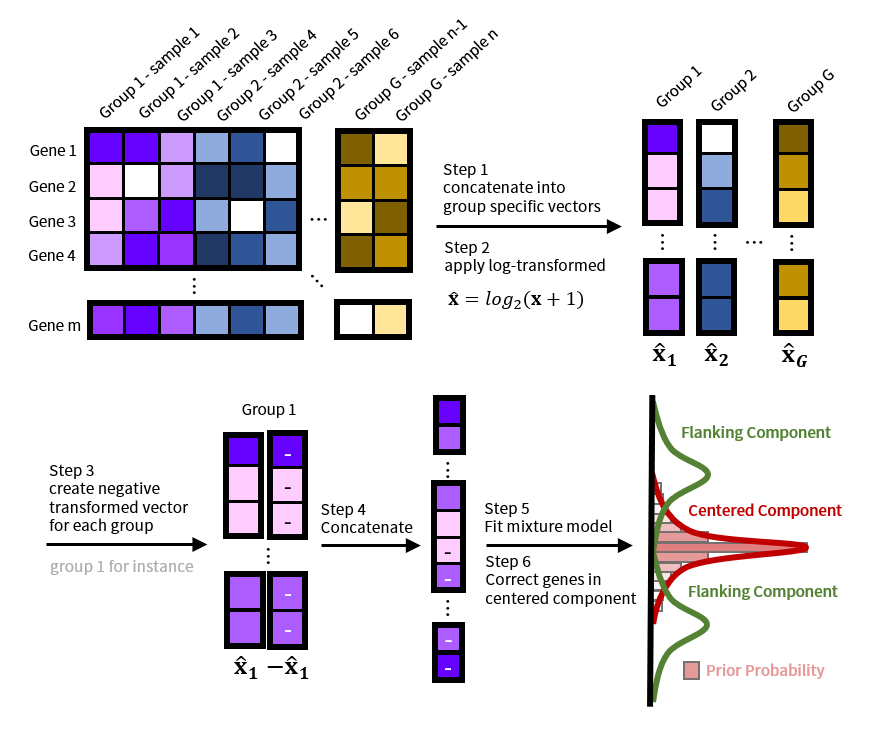

# CAIMAN
Count Adjustment to Improve the Modeling of Gene Association Networks (CAIMAN) is an algorithm that corrects for false-positive associations, which may form between lowly expressed genes after quantile-based normalization of the data, and which may affect downstream co-expression network analysis.

## Introduction
CAIMAN is an algorithm developed by the [Kuijjer Lab](https://www.kuijjerlab.org/) that is specifically designed to correct false-positive gene associations in RNA-Seq data that is normalized with quantile-based methods, such as [smooth quantile normalization](https://academic.oup.com/biostatistics/article-lookup/doi/10.1093/biostatistics/kxx028. CAIMAN utilizes a Gaussian mixture model to fit the distribution of gene expression and to adaptively select a threshold to define lowly expressed genes. Thereafter, CAIMAN corrects the normalized expression for these genes by removing the variability across samples that might lead to false positive associations. The CAIMAN algorithm is available in a Python software package.

## Method
CAIMAN starts by log₂-transforming normalized expression levels to approximate a Gaussian distribution. These processed expression levels are then augmented by concatenating negative transformed expression levels. This makes the augmented expression distribution symmetric with respect to zero. A Gaussian mixture model is then used with the center component fixed, with a mean equal to zero. The genes with high posterior probability to the center component are believed to be non-expressed in the cell. For those genes, CAIMAN replaces the normalized expression with zero. This removes false-positive associations that may have been introduced by quantile-based normalization methods.


# Usage
## Installation
### Environment Setting
It is highly recommended to use the [conda](https://docs.conda.io/projects/conda/en/latest/index.html) virtual environment to install this package. After installation of conda, create a virtual environment for CAIMAN using the following command:
```bash
$ conda create -n caiman python=3.7.7
$ conda activate caiman
```

### Install Package
Download the source code from `git@github.com:kuijjerlab/CAIMAN.git` and install the package using `pip`:
```bash
$ git clone git@github.com:kuijjerlab/CAIMAN.git
$ cd Caiman
$ pip install -e .
```
To reproduce the analysis we provide in the manuscript:
```bash
$ conda activate caiman
$ conda config --add channels bokeh
$ conda config --add channels defaults
$ conda config --add channels bioconda
$ conda config --add channels conda-forge
$ conda install --file analysis_requirement.txt
```

### Example Dataset
The CAIMAN packages includes an example dataset for users to test the method on. This can be found under the following directories. The `expression.tsv` contains expression levels for 10,000 randomly selected genes from [the Mouse ENCODE Project Consortium](https://www.encodeproject.org/reference-epigenome-matrix/?type=Experiment&related_series.@type=ReferenceEpigenome&replicates.library.biosample.donor.organism.scientific_name=Mus+musculus). 
```bash
$ test/expression.tsv
$ test/groups.tsv
```

## Quick Start
After installation, CAIMAN can be executed directly as a Python module using the following command:
```
$ python3 -m caiman test/expression.tsv --groups test/groups.tsv --dist --outdir output
```
The complete arguments are listed as follows (one can get this information by executing `python3 -m caiman --help`)
```
usage: __main__.py [-h] [-g [path]] [-m {'filter', 'noise'}] [-o [path]] [-a]
                   [-s] [-d] [-v]
                   xprs

positional arguments:
  xprs                  Path to the expression data. The file should be
                        formatted as follows: the rows should represent genes
                        (the first row must be the sample names), and the
                        columns should represent samples (the first column
                        must be the gene names). The columns must be separated
                        with <tab>.

optional arguments:
  -h, --help            show this help message and exit
  -g [path], --groups [path]
                        Path to the group information for each sample. The
                        file should have two columns without any header. The
                        first column should be the sample names, corresponds
                        to the columns in xprs. The second column should be
                        the group information for each sample. The two columns
                        must be separated by <tab>. If this argument is not
                        provided, the algorithm will treat all samples as one
                        group.
  -m {'filter', 'noise'}, --method {'filter', 'noise'}
                        Method used to adjust the normalized read count,
                        should be either 'filter' or 'noise'. Default:
                        'filter'.
  -o [path], --outdir [path]
                        Output directory for the corrected read counts. The
                        directory consists of a data table 'caiman_out.tsv'
                        with the corrected expression levels. There are also two optional
                        subdirectories 'dist' and 'gmms'. The first directory
                        contains an interactive html file visualizing the
                        sampling distribution and the posterior probability of
                        the fitted model for each group. The second directory
                        contains instances of GaussianMixtureModel fitted for
                        each group. Default: './caiman_output'.
  -a, --adaptive        Whether to use likelihood ratio test to determine the
                        optimal number of components. Default: unset.
  -s, --save_model      Save instances of GaussianMixtureModel fitted for each
                        group in 'gmms'. Default: unset.
  -d, --dist            Save interactive html file visualizing the sampling
                        distribution and the posterior probability of the
                        fitted model for each group in 'dist'. Default: unset.
  -v, --verbose         Enable verbose message when fitting. Default: unset.

```

## Reproduce Analysis in the Manuscript
To reproduce analysis in the manuscript:
```bash
$ snakemake --cores [n]
```
The result can be found in the directory `manuscript_analysis`. Note that it will likely take a while to download and preprocess the datasets.

## Application Programming Interface
CAIMAN also provides an application programming interface (API) in Python for developers or bioinformaticians who wants to control more parameters used in the analysis.

### Correct Expression
```python
import os
from caiman import Analysis

xprs = os.path.realpath('test/expression.tsv')
groups = os.path.realpath('test/groups.tsv')

analysis = Analysis(xprs, groups, **{'index_col': 0, 'sep': '\t'})
corrected = analysis.correct(
    method='filter',
    adaptive_num_components=False,
    verbose=False,
)
corrected.to_csv(os.path.realpath('caiman_out.tsv'), sep='\t')
```

### Information of Input Data
```python
print(analysis.dataset)
```

### Interactive Visualization
Please execute this after `analysis.correct()`
```python
analysis.distplot('Liver', outdir='outdir')
```


### Get Fitted GaussianMixtureModels
Please execute this after `analysis.correct()`. 

For specific group:
```python
gmm = analysis.get_gmm('Liver')
print(gmm)
```
Result:
```
GaussianMixtureModel

Attributes
    num_iterations:             10
    verbose:                 False
    store_checkpoints:       False
    adpative_num_components: False
    is_fitted:                True

Statistics
    num_components:
    3

    means:
    [ 0.        10.543127   4.2125125]

    standard deviations:
    [0.17445941 1.5966247  3.590845  ]
```
For every group:
```python
gmms = analysis.get_gmm()
print(gmm)
```
Result:
```
{'Embryonic Facial Prominence': <caiman.model.GaussianMixtureModel>, 'Forebrain': <caiman.model.GaussianMixtureModel>, 'Heart': <caiman.model.GaussianMixtureModel>, 'Hindbrain': <caiman.model.GaussianMixtureModel>, 'Intestine': <caiman.model.GaussianMixtureModel>, 'Kidney': <caiman.model.GaussianMixtureModel>, 'Limb': <caiman.model.GaussianMixtureModel>, 'Liver': <caiman.model.GaussianMixtureModel>, 'Lung': <caiman.model.GaussianMixtureModel>, 'Midbrain': <caiman.model.GaussianMixtureModel>, 'Neural Tube': <caiman.model.GaussianMixtureModel>, 'Stomach': <caiman.model.GaussianMixtureModel>}
```

### Fitted Statistics
Get fitted means.
```python
means = gmm.get_means()
print(means)
```
Result:
```
array([ 0.       , 10.543127 ,  4.2125125], dtype=float32)
```
Get fitted standard deviations.
```
stds = gmm.get_stds()
print(stds)
```
Result:
```
array([0.17445941, 1.5966247 , 3.590845  ], dtype=float32)
```

### Sample from GaussianMixtureModels
Please execute this after `analysis.correct()`. The first element in the returned tuple is the sampling expression value, while the second element denotes the labels.
```python
sampled = gmm.sample(100)
print(sampled)
```
Results:
```
(array([ 0.36919074, -0.10474598,  0.09662524, -0.07132469, 13.06010501,
         8.73190427,  9.51180642, 10.94915712, 11.04356705, 11.81309644]),
 array([0, 0, 1, 1, 2, 2, 2, 2, 2, 2]))
```

### Predict with GaussianMixtureModels
Please execute this after `analysis.correct()`. Return the label of input data.
```python
gmm.predict(np.linspace(0, 1000, 100))
```
Results:
```
array([0, 2, 2, 2, 2, 2, 2, 2, 2, 2, 2, 2, 2, 2, 2, 2, 2, 2, 2, 2, 2, 2,
       2, 2, 2, 2, 2, 2, 2, 2, 1, 1, 1, 1, 1, 1, 1, 1, 1, 1, 1, 1, 1, 1,
       1, 1, 1, 1, 1, 1, 1, 1, 1, 1, 1, 1, 1, 1, 1, 1, 1, 1, 1, 1, 1, 1,
       1, 1, 1, 1, 1, 1, 1, 1, 1, 1, 1, 1, 1, 1, 1, 1, 1, 1, 1, 1, 1, 1,
       1, 1, 1, 1, 1, 1, 1, 1, 1, 1, 1, 1])
```

### Posterior Probability
Please execute this after `analysis.correct()`. Return the posterior probability of each component given the input data.
```python
gmm.predict(np.linspace(0, 1000, 10))
```
Results:
```
array([[9.7392517e-01, 0.0000000e+00, 0.0000000e+00, 0.0000000e+00,
        0.0000000e+00, 0.0000000e+00, 0.0000000e+00, 0.0000000e+00,
        0.0000000e+00, 0.0000000e+00],
       [3.9015721e-11, 1.1948496e-01, 3.7362605e-01, 5.5182225e-01,
        6.5891063e-01, 7.2536421e-01, 7.6906377e-01, 7.9936570e-01,
        8.2131582e-01, 8.3778638e-01],
       [2.6074827e-02, 8.8051498e-01, 6.2637395e-01, 4.4817781e-01,
        3.4108940e-01, 2.7463582e-01, 2.3093626e-01, 2.0063429e-01,
        1.7868416e-01, 1.6221364e-01]], dtype=float32)
```
For a more detailed description, please refer the the documentation of CAIMAN.

